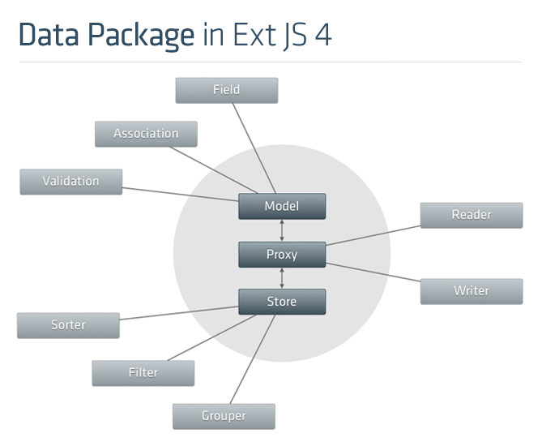

Bancha Frontend
===============

Bancha Frontend Workspace
-------------------------

In the frontend ExtJS provides us with an class system, as well as a
very powerful model class. This class also provides connectors for
proxies and stores. Stores in ExtJS are a wrapper over a set of model
entries (like a table in databases).

As you can see in the diagram, a model definition has multiple fields,
associations and validation rules. Bancha provides on the backend a
method for loading these configurations from the CakePHP model
configuration. On the client-side we use this schema and validation
rules (metadata) to provide remotable models to the user. This is done
via *BanchaController*.

   Figure 1

The ExtJS 4 Data Package structure.

Bancha Frontend Architecture
----------------------------

Bancha provides on the client-side methods for loading metadata and
retrieving models. In the background it uses some server-side Bancha
functions and the RPC architecture. We have one singleton Bancha which
is done as a facade pattern. It hides the logic of lazy loading
metadata, interpreting it, handling consistency and using Ext Direct.

The developer mainly will use one of two functions to get models:

-  *Bancha.onModelReady(modelNames, callback, scope)* executes the
   callback as soon as the metadata is loaded
-  *Bancha.getModel(modelName)* (after *Bancha.init()*, returns the
   model (on first request it also creates it, singleton pattern)

It also supplies some advanced functions:

-  *Bancha.preloadModelMetaData(modelNames,callback,scope)* for
   performance boosts
-  *Bancha.createModel(modelName, modelConfig)* if you want to add
   additional configurations to the model

.. figure:: images/image03.png
   :align: center
   :alt: Figure 2

   Figure 2

Figure 2: Overview of the Bancha frontend architecture.

Scaffolding
-----------

Additionally Banchas JavaScript provides extensive scaffolding
functionality for forms and grids. The challenge here was how to expose
enough, but not too much configurations. If everything is totally
configurable the scaffolding gets more complex then actually writing
standard code and therefore brings no additional value. On the other
side if too less can be configured it is not helpful either.

Our solution was to expose all styling and event handling (button
pressing, etc.), but keep schema transformations, validation rules and
internal logic hidden. We provide good defaults for all configurations
and two ways to change them. All properties are changeable on a static
singleton which effects the scaffolding globally. Alternatively to the
global config the user can override properties for a single scaffold
action by passing a configuration object.

The configuration consist of configurations for the whole panel,
configurations for fields and columns and interceptor functions to
change the default behavior.

For more details see our extensive `JavaScript API
documentation <http://docs.banchaproject.org/js/#/api/Bancha>`_

Input Validation
----------------

One of your goals was to make scaffolding with CakePHP and ExtJS easy.
In CakePHP all validation rules are configured in one format, but in
ExtJS we have many different formats.

   Figure 3

Figure 3: Part of the ExtJS 4 form panel structure to highlight the
different validation classes.

The model class provides some very basic validation functions using the
*Ext.data.validations* singleton. Form fields use some easy
configurations directly on the field, as well as advanced rules from the
**Ext.form.field.VTypes** singleton.

Bancha will transform CakePHP model validation rules in ExtJSs
*Ext.data.validation* format. To not loose information here we extended
the singleton by adding two new types: *numberformat* and *file* (see
`API
Docs <http://docs.banchaproject.org/js/#/api/Ext.data.validations>`_).

When scaffolding a form we transform the model validation rules into
either a form field or a *vtype* validation rules. For this reason we
also added the *VType* method *fileExtension*.
