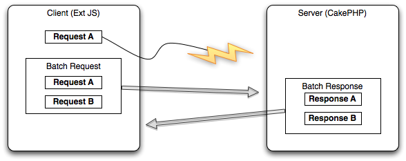

Consistent Model (Not yet implemented!)
=======================================

One of the main challenges with asynchronous applications is to keep the
data both on the client and the server consistent. First of all we need
to take a look on how ExtJS handles lost requests or responses in order
to ensure consistency. When ExtJS sends a request to the server it first
checks if it has received a response for previous requests. If it has
not received a response for a previous request it will resend the old
request together with the new request. This is shown in figure 3.

|Figure 3| Figure 3: ExtJS resends requests with further requests if it
gets no response for the first one.

If the request is lost there is no problem for the consistency. Bancha
can handle batch requests and will therefore execute all requests and
sends a batch response to the client. The problem is when the request is
not lost, but when either the response is lost or when the execution of
a request takes a long time and therefore the request is resent by
ExtJS. To ensure consistency in these scenarios Bancha saves the
transaction ID of the request that is currently processed. If the
request is later resent by ExtJS, Bancha knows that this request is
currently processed and discards it. Bancha will also discard other
requests with higher transaction IDs in order to ensure consistency.
This is required because Bancha does know nothing about the dependencies
of different requests. For example, Bancha discards Request A which
creates a new user because it this request is currently processed in
another process. Request B could be either an dependent task, like
editing the user created in Request A or a completely independent task
like deleting another user. While this example is trivial and could be
resolved by an algorithm there are far more complicated use cases. For
example, Request B could be create an article and add the user created
in Request A as author. Thus Bancha discards all requests if a request
with a higher transaction ID is currently handled. It is the duty of
ExtJS to resend the discarded requests either when another request is
sent or after a timeout.

One of the challenges when developing the consistent model functionality
for Bancha is to test the written code. PHP offers no possibility to run
code in parallel and therefore it is not easily possible to simulate the
scenario where a request takes a very long time to process, which
results in resending this request. Our solution for this problem is to
move the code to handle the request in a separate test script and use
exec() to execute two PHP scripts simultaneously in the background.

The Consistent Model is implemented in Bancha by adding a client id to
the request. This ID is generated on the server when the client requests
the metadata and is then transferred with every request to the server.
Bancha creates a temporary file for every client where it stores the
currently processed transaction ID. When another request from the same
client with an equal or higher transaction ID arrives at the server, the
server discards this request. The client needs to resend this request
later. In general this is no problem because Ext Direct resends
automatically all requests, where it hasn’t received a response.

