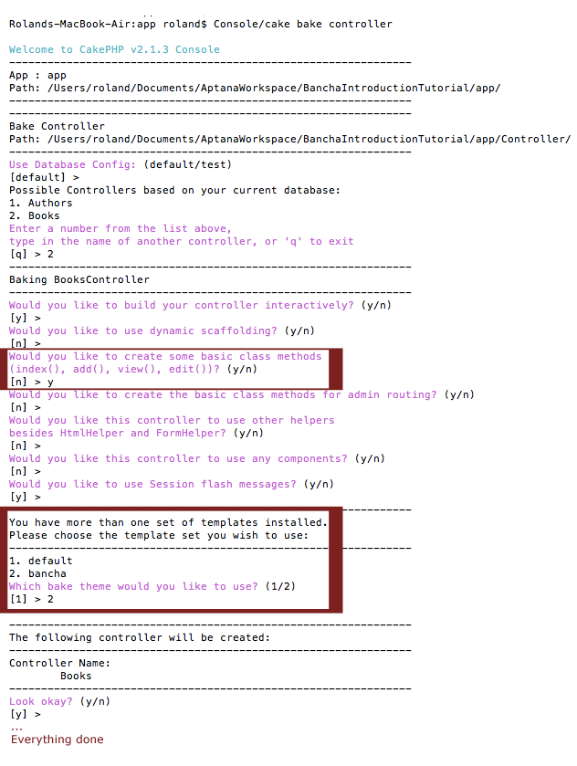

How to Expose Models
====================

To expose the crud methods of an model to ExtJS follow these steps:

1. Add ``public $actsAs = array("Bancha.BanchaRemotable");`` to the
   models you want to expose
2. Setup your controller (see below)

Setup your controller for Bancha
--------------------------------

The easy way: Baking your controller
~~~~~~~~~~~~~~~~~~~~~~~~~~~~~~~~~~~~

The easiest way is to just bake a controller using the CakePHP bake
console with Banchas controller template:

   How to bake a controller

For more details see the
`CakePHP documentation <http://book.cakephp.org/2.0/en/console-and-shells/code-generation-with-bake.html>`_.

For already existing controllers
~~~~~~~~~~~~~~~~~~~~~~~~~~~~~~~~

The changes to your controller are actually quite easy. You only need to
provide a return value for every controller function. Bancha will use
this value to generate the response. Here you can find two samples of
how to extend your controller to wirk with Bancha:

.. toctree::
   :maxdepth: 2

   Controller-Augmentation-Alternative-1
   Controller-Augmentation-Alternative-2

What's next
~~~~~~~~~~~

That's it, now you can write normal ExtJS code using
Bancha.onModelReady(modelName,fn) and Bancha.getModel(modelName) or you
take a look at our powerfull `Scaffolding library <http://scaffold.banchaproject.org>`_, 
which uses all the Bancha meta data to create grids grids and forms with an minimal markup.
For example: *Ext.create("Ext.grid.Panel",{scaffold:'User'});*

Fine tuning
-----------

Bancha will expose only the CRUD functions which are implemented in the
controller. This gives you all options for security like any normal
cakephp site.

Bancha will automatically recognize model validation rules, and provide
them as well on the client side in ExtJS. See `Supported Validation
Rules <http://docs.banchaproject.org/resources/Supported-Validation-Rules.html>`_

::

           Note: Currently Bancha can not handle Controller::setFlash() and Controller::redirect() 

Side note: Bancha augments the models a bit, validations and save
operations are only are executed on defined fields, validation will not
fail if a field is missing - this is because ExtJS only send the changed
fields in an edit request. If you don't like this set the BanchaBehavior
setup config to *array('useOnlyDefinedFields'=>false)*. Keep in mind to
then use *$model->saveFields($data, $options)* for Bancha requests instead 
of *$model->save()*.

Trouble Shooting
----------------

We are currently only aware of one constraint. Please make sure that the
primary's field of the model is called *id* (cake default). That's it.

